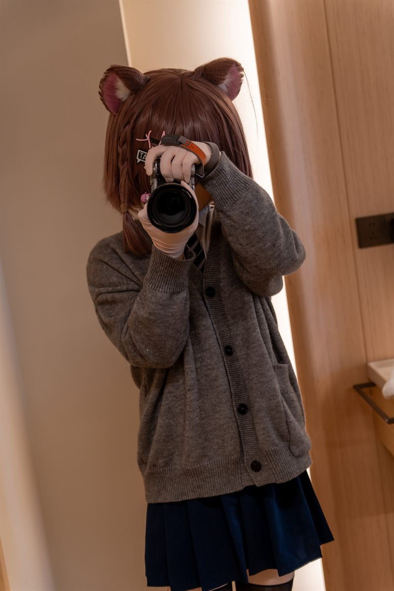

# Mk18_19X 的个人主页（纯静态单页）

一个零依赖的**单页**个人网站：顶部导航 + 关于我 + Kigurumi 图片集 + 兴趣 + 页脚，
自带响应式布局和明暗主题切换。**双击 `index.html` 就能在浏览器打开**，不需要安装任何环境。

## 目录结构

```
personal-website/
├── index.html         整个网站都在这一个文件里
├── css/
│   ├── style.css      全局样式：主题变量、导航、卡片、页脚、响应式
│   └── gallery.css    Kigurumi 图片集的堆叠 / 展开样式
├── js/
│   └── main.js        主题切换 / 移动端菜单 / 页脚年份 / 图片集展开收起
├── assets/            照片墙真正加载的六张照片（kigu-1.jpg ~ kigu-6.jpg）
├── pkg/               照片原图 1.JPG ~ 6.JPG（约 60 MB，只留档，网页不加载）
├── tools/
│   └── resize-photos.ps1   把 pkg/ 里的原图压缩进 assets/ 的小脚本
├── 头像.png           你的头像
└── README.md
```

## 页面结构

| 区块 | 位置 | 说明 |
|---|---|---|
| 顶部导航 | `<header class="site-header">` | 品牌名 + 主页链接 + 主题切换按钮 |
| 关于我 | `<section class="hero" id="about">` | 「我是 Mk18_19X」+ 介绍文字 + 头像 |
| Kigurumi 图片集 | `<section class="section" id="gallery">` | 六张照片，收起时横向叠成一排 |
| 工作之外 | `<section class="section" id="interests">` | 三张卡片：游戏 / 音乐 / 摄影 |
| 页脚 | `<footer class="site-footer">` | 社交链接 + 年份（自动更新） |

## 怎么改成你自己的

用任意文本编辑器（VS Code、记事本都行）打开 `index.html`，每一处要改的地方都写了 `<!-- ... -->` 注释：

| 要把什么改掉 | 去哪里改 |
|---|---|
| 名字 `Mk18_19X` | `index.html` 全文查找替换（导航、大标题、页脚共 3 处） |
| 自我介绍 | `index.html` 里 `.lead` 那段文字 |
| 头像 | 直接换掉 `头像.png`；或改 `` 的 `src` |
| 兴趣三张卡片 | `index.html` 里 `#interests` 里三个 `<article class="card">` |
| 社交链接 | 页脚 `.socials` 里把 `href="#"` 和 `you@example.com` 换成你自己的 |
| 主题色 | `css/style.css` 顶部 `:root` 里的 `--primary` 和 `--accent`（改一处全站生效） |

## Kigurumi 图片集

照片已经装好了：`assets/kigu-1.jpg` ~ `kigu-6.jpg` 就是照片墙里的六张，顺序按 1 → 6
（第 1 张在最上层，往后依次往下压），对应 `index.html` 里这六行：

```html

```

- **换照片**：直接替换 `assets/` 里同名的文件即可，HTML 一个字都不用改；
  想用别的文件名，就改上面 `src` 里的路径。
- **加照片**：复制一行、把编号改成 `kigu-7.jpg`。注意叠放层次是按位置写死的，
  张数变成 7 张时要在 `css/gallery.css` 里补一条
  `.stack-gallery .stack-item:nth-child(7) { z-index: 0; }`。

**显示效果**：收起时六张横着叠成一排，点「查看全部照片」按钮展开 ——
桌面 / 平板是一行三张、共两行；手机（≤ 480px）是一行两张、共三行。
格子统一是竖版 3:4，照片本身比例不同也没关系，会居中裁切填满（不会拉变形）。
想改成横版：打开 `css/gallery.css`，把顶部这行改成 `4 / 3`：

```css
--item-ratio: 3 / 4;   /* 竖版 3:4（默认）；想横版就写 4 / 3 */
```

同一个文件顶部还有几个可调参数：

- `--item-w` —— 收起时每张照片的宽度
- `--peek` —— 收起时每张露出多少，数值越大叠得越开
- `--gap` —— 展开后照片之间的间距

### 照片为什么是压缩过的

`pkg/` 里的原图（`1.JPG` ~ `6.JPG`）合计约 60 MB，这么大直接挂到网页上会慢到打不开。
`assets/` 里是压缩后的版本：长边最多 1200px、JPEG 质量 82，六张合计约 520 KB，
并且已经按 EXIF 方向摆正、去掉了旋转信息 —— 手机拍的照片不会横躺着显示。

再压新照片，两种办法都行：

1. 用图片软件批处理：长边 1200px、JPEG 质量 80~85，覆盖 `assets/` 里的同名文件；
2. 把新原图丢进 `pkg/`，然后在项目目录执行：

```powershell
powershell -NoProfile -ExecutionPolicy Bypass -File tools\resize-photos.ps1
```

脚本会按文件名里的数字排序，依次生成 `assets/kigu-1.jpg`、`kigu-2.jpg` …（原图不动）。
想换尺寸或画质，加参数即可：`-MaxSide 1600 -Quality 88`。

> 部署上线前可以把整个 `pkg/` 删掉 —— 网页完全不引用它，留着只是白占空间。

## 本地预览（可选）

直接双击 `index.html` 就行。若想要更接近线上环境（访问 `http://localhost:8000`），
在项目目录打开终端执行：

```powershell
cd c:\Users\35304\ai2\personal-website
python -m http.server 8000
```

然后浏览器访问 <http://localhost:8000>。按 `Ctrl + C` 停止。

## 怎么部署到网上（免费）

这是纯静态站点，托管非常容易，任选其一：

1. **GitHub Pages**：新建仓库 → 上传本项目文件 → 仓库 Settings → Pages → 选 `main` 分支根目录 → 保存。
2. **Netlify / Vercel**：把整个文件夹拖进它们的网页上传区，几秒后就有网址。
3. 有个域名的话，也可以传到任意虚拟主机。

## 说明

- 网站没有后端，内容全部写死在 `index.html` 里。改完保存、刷新浏览器就能看到。
- 页脚年份由 `js/main.js` 自动填成当前年份，不用每年手动改。
- 主题（浅色 / 深色）会记在浏览器里，下次打开还是你上次选的那个。
- 目前没有留言表单（静态站点没有后端收不到）。想加的话，最简单的办法是接入
  **Formspree** 或 **Netlify Forms**。
